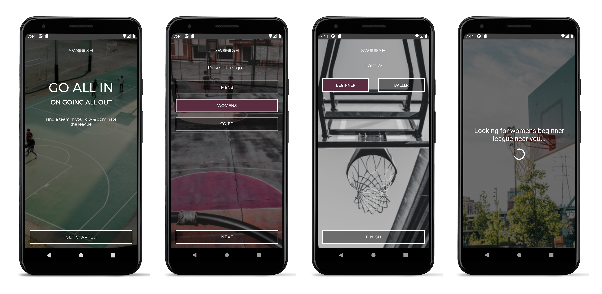

# SwooshApp
> Tutorial baseball team finder app

## Screenshots

## Technologies

### Android
* [View Binding](https://developer.android.com/topic/libraries/view-binding)
An Android feature that allows your code to easily interact with views in a compile-safe way.
* [Multiple Activities Application](https://developer.android.com/reference/android/app/Activity)
App uses multiple activities that communicate data between screens via Intents.
